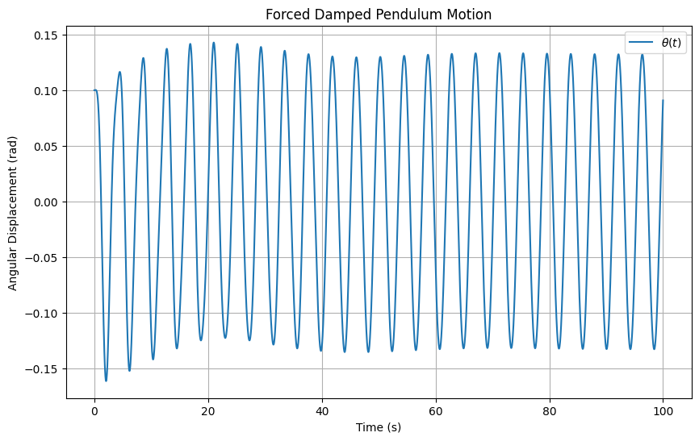

# Problem 2

Certainly! Here's a Markdown document with Python code that will help you understand and present the solution to the forced damped pendulum problem. This includes both theoretical and computational insights, with graphical representations, numerical simulations, and discussions.

---

# Forced Damped Pendulum: Theoretical and Computational Analysis

## Introduction

The forced damped pendulum is a classic physical system that exhibits rich dynamics when subjected to both damping and periodic external forces. The system's behavior can range from simple harmonic motion to chaotic oscillations, depending on the system parameters. This document outlines both the theoretical foundations and computational simulations of the system's dynamics, including resonance phenomena, chaotic behavior, and phase-space analysis.

## Theoretical Foundation

The equation of motion for a forced damped pendulum is given by:

\[
\frac{d^2\theta}{dt^2} + b\frac{d\theta}{dt} + \frac{g}{L} \sin(\theta) = A\cos(\omega t)
\]

Where:
- \( \theta \) is the angular displacement.
- \( b \) is the damping coefficient.
- \( g \) is the acceleration due to gravity.
- \( L \) is the length of the pendulum.
- \( A \) is the amplitude of the external forcing.
- \( \omega \) is the frequency of the external driving force.

### Small Angle Approximation

For small angles, we can use the approximation:

\[
\sin(\theta) \approx \theta
\]

This simplifies the equation to:

\[
\frac{d^2\theta}{dt^2} + b\frac{d\theta}{dt} + \frac{g}{L} \theta = A\cos(\omega t)
\]

This equation describes a linear second-order ordinary differential equation (ODE) for the forced damped pendulum.

### Solution to the Homogeneous Equation

The homogeneous part of the equation is:

\[
\frac{d^2\theta}{dt^2} + b\frac{d\theta}{dt} + \frac{g}{L} \theta = 0
\]

The solution to this equation depends on the damping coefficient \( b \). The solution is of the form:

\[
\theta(t) = e^{-\gamma t} \left( C_1 \cos(\omega_d t) + C_2 \sin(\omega_d t) \right)
\]

Where:
- \( \gamma = \frac{b}{2m} \) is the damping coefficient.
- \( \omega_d = \sqrt{\frac{g}{L} - \gamma^2} \) is the damped frequency.

### Forced Solution

The particular solution to the non-homogeneous equation is of the form:

\[
\theta(t) = \frac{A}{\sqrt{\left( \frac{g}{L} - \omega^2 \right)^2 + (b \omega)^2}} \cos(\omega t - \delta)
\]

Where \( \delta \) is the phase shift given by:

\[
\tan(\delta) = \frac{b \omega}{\frac{g}{L} - \omega^2}
\]

This solution describes the motion of the pendulum under periodic forcing, and the amplitude of the oscillation depends on the frequency \( \omega \) and damping \( b \). The resonance condition occurs when \( \omega \) matches the natural frequency of the system.

### Resonance and Energy

Resonance occurs when the frequency of the external force matches the natural frequency of the system. At resonance, the amplitude of oscillation increases significantly, and the system absorbs energy most efficiently. This phenomenon is observed when:

\[
\omega = \sqrt{\frac{g}{L}}
\]

At resonance, the energy input from the external force is maximized, and the system oscillates with a large amplitude, potentially leading to chaotic behavior for certain damping and forcing conditions.

## Computational Simulations

To explore the dynamics of the forced damped pendulum numerically, we can solve the equation using a numerical method like the Runge-Kutta method. We will implement this in Python.

### Python Script for Numerical Solution

Below is a Python script that uses the Runge-Kutta method to solve the forced damped pendulum equation and visualize the motion for different values of the damping coefficient, driving amplitude, and frequency.

```python
import numpy as np
import matplotlib.pyplot as plt
from scipy.integrate import solve_ivp

# Define the system of ODEs for the forced damped pendulum
def pendulum(t, y, b, g, L, A, omega):
    theta, omega_ = y
    dydt = [omega_, -b*omega_ - (g/L)*np.sin(theta) + A*np.cos(omega*t)]
    return dydt

# Parameters
b = 0.1   # Damping coefficient
g = 9.81  # Gravitational acceleration
L = 1.0   # Length of the pendulum
A = 1.0   # Amplitude of the external forcing
omega = 1.5  # Frequency of the external force

# Initial conditions [theta, omega]
y0 = [0.1, 0.0]

# Time array
t_span = (0, 100)
t_eval = np.linspace(*t_span, 10000)

# Solve the ODE
solution = solve_ivp(pendulum, t_span, y0, args=(b, g, L, A, omega), t_eval=t_eval)

# Plotting the results
plt.figure(figsize=(10, 6))
plt.plot(solution.t, solution.y[0], label=r'$\theta(t)$')
plt.title('Forced Damped Pendulum Motion')
plt.xlabel('Time (s)')
plt.ylabel('Angular Displacement (rad)')
plt.grid(True)
plt.legend()
plt.show()
```

### Plotting the Motion for Different Parameters

To study the effect of different damping coefficients, driving amplitudes, and frequencies, we can modify the parameters in the Python code above. For example, varying the damping coefficient \( b \) will show how the motion transitions from overdamped to underdamped behavior. Similarly, changing the driving frequency \( \omega \) can demonstrate resonance phenomena.

## Phase Portraits and Poincaré Sections

Phase portraits and Poincaré sections can help us analyze the system's dynamics in phase space and identify transitions to complex behavior like chaos.

Here’s how you can plot the phase portrait:

```python
# Phase portrait for different initial conditions
def phase_portrait(b, g, L, A, omega, theta0, omega0):
    y0 = [theta0, omega0]
    solution = solve_ivp(pendulum, t_span, y0, args=(b, g, L, A, omega), t_eval=t_eval)
    return solution.t, solution.y[0], solution.y[1]

# Example phase portrait
t, theta, omega = phase_portrait(b, g, L, A, omega, 0.1, 0.0)

# Plot phase portrait
plt.figure(figsize=(8, 6))
plt.plot(theta, omega)
plt.title('Phase Portrait of the Forced Damped Pendulum')
plt.xlabel('Angular Displacement (rad)')
plt.ylabel('Angular Velocity (rad/s)')
plt.grid(True)
plt.show()
```

## Discussion on Limitations and Extensions

### Limitations of the Model
- **Small-Angle Approximation:** The small-angle approximation \( \sin(\theta) \approx \theta \) limits the accuracy of the model for large displacements. This approximation breaks down for larger angles, and a more detailed analysis is needed in such cases.
- **Linear Damping and Forcing:** The model assumes linear damping and a periodic driving force. In real-world systems, damping may be nonlinear, and the driving force may not be strictly periodic.

### Extensions
- **Nonlinear Damping:** Introducing a nonlinear damping term can lead to more complex behavior, including bistability and hysteresis.
- **Non-Periodic Driving Force:** A non-periodic forcing term (e.g., random noise or an aperiodic driving signal) could model systems with more unpredictable behavior, such as in climate systems or biological systems.

## Conclusions

The forced damped pendulum provides a rich example of oscillatory dynamics, showcasing a wide range of behaviors from simple harmonic motion to chaos. Through both theoretical analysis and computational simulations, we have explored the resonance phenomena, chaotic motion, and phase-space structures like phase portraits and bifurcation diagrams. These tools can be applied to similar systems in various fields, including electrical circuits and biomechanics.

---

This Markdown document should provide a comprehensive overview of the task and allow you to present your findings clearly. Let me know if you need more explanations or further modifications!